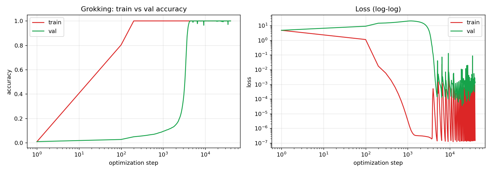
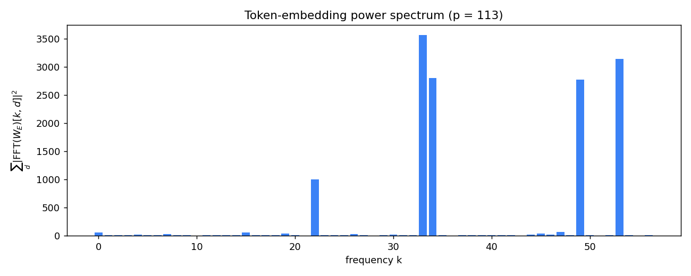
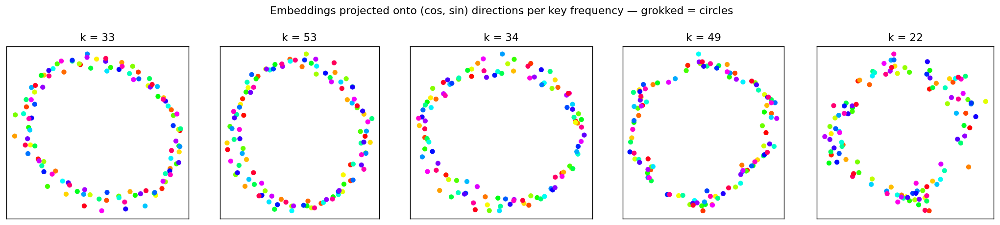
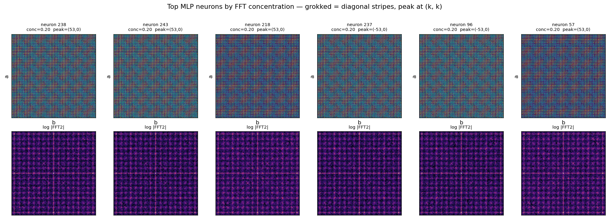
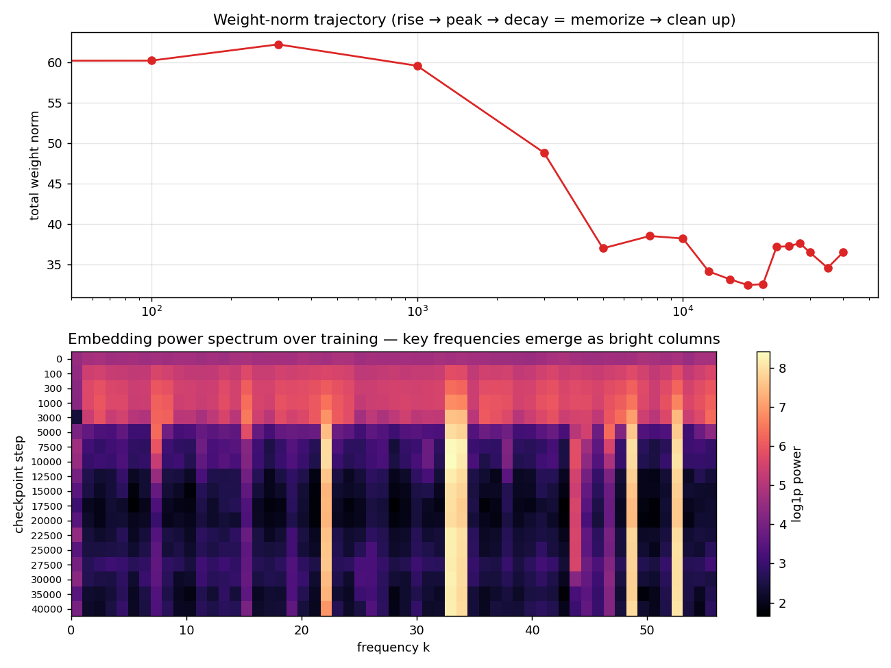

# Grokking, from scratch

Train a tiny transformer on modular arithmetic and something strange happens:
it **memorizes** the training data in 200 steps, then spends thousands of
steps stuck at random chance on everything it hasn't seen — and then,
abruptly, it *gets it*, jumping to ~100% accuracy on equations it was never
trained on. OpenAI researchers named this delayed generalization
**grokking** ([Power et al. 2022](https://arxiv.org/abs/2201.02177)).

This repo reproduces the phenomenon end-to-end on a laptop (~8 minutes),
then opens the network up and finds the algorithm it discovered: the model
invents a **Fourier transform** — it places the numbers on circles and adds
them by rotation.

The transformer is written from scratch in raw PyTorch tensors — no
`nn.Module`, no `nn.Linear`, no `nn.Embedding`. Every weight is a plain
tensor and the forward pass is explicit einsum/matmul/softmax, readable
top-to-bottom in [`grok_from_scratch.py`](grok_from_scratch.py). The
architecture and training config follow
[Nanda et al. 2023](https://arxiv.org/abs/2301.05217), the paper that first
reverse-engineered what grokked networks actually learn.

## What is grokking?

The standard mental model of overfitting says: once training accuracy hits
100% and validation accuracy is stuck near zero, you're done — the model has
memorized, and more training won't help. Grokking breaks that intuition.
On small algorithmic datasets, if you keep training *far* past the point of
overfitting (with regularization, especially weight decay), validation
accuracy eventually snaps from chance to perfect. The network abandons its
memorized lookup table in favor of the actual rule — long after it stopped
having any training-loss reason to change.

## Why does it happen? — the short answer

Two solutions compete inside the network. **Memorization** is easy to find,
so gradient descent finds it first — but it's expensive: storing 3,830
arbitrary facts takes many weights, each reinforced by only a few examples.
**The real rule** is hard to find but cheap to run: a few reused weights
handle every equation. Weight decay taxes all weights all the time, and
that tax decides the race — the memorized weights can't pay it, the reused
ones can. So while training loss sits at zero, the general circuit quietly
grows and the memorized one decays away.

And the suddenness is an illusion. Open the model up (as this repo does)
and the transition is **gradual inside**: the rule-circuit forms steadily
through the plateau; validation accuracy only snaps upward at the moment
that circuit finally outweighs the memorization it was hiding behind. We
know this because the circuit is directly visible in the weights while
val accuracy still sits at chance — see
[How grokking happens](#how-grokking-happens) below for the plots.

## The task

Learn `(a + b) mod 113` from examples. There are 113² = 12,769 possible
equations; the model trains on a random 30% (3,830) and is evaluated on the
held-out 70% (8,939) it never sees.

Each equation is three tokens. `37 + 1 = 38` becomes:

```
input   [ 37,  1, 113 ]     ← token IDs for  "37"  "1"  "="
label     38                ← the token the model must predict at '='
```

The vocabulary is 114 symbols: the numbers 0–112 (113 residues — one per
possible value mod 113) plus `=` as token 113. There is no `+` token; every
sequence has the same shape, so the operation is implicit.

One thing to internalize: **the numbers are opaque symbols, not numerals.**
Token 37 is just ID #37 — the model never sees digits, never knows 38 comes
after 37, and can't compute anything *from* the ID. It's handed 30% of the
cells of a 113×113 answer table, like a giant Sudoku, and has to fill in
the rest. The only way to do that better than chance is to discover the
table's hidden structure.

## The model

The smallest possible GPT: one attention block and one MLP on a residual
stream. 226,176 parameters. No LayerNorm, no biases — stripped to the
studs, which is exactly what makes it possible to read the learned
algorithm out of the weights later.

```
     input:  [ a ,  b ,  = ]
                │
                ▼
   EMBED        resid = W_E[token] + W_pos          W_E: 114×128 lookup table
                │                                   (one learned vector per symbol)
                ▼
   ATTENTION    4 heads, causal mask                the '=' position pulls in
                resid = resid + attn(resid)         the vectors for a and b
                │
                ▼
   MLP          512 ReLU neurons                    combines the a- and b-features
                resid = resid + mlp(resid)          (this is where the math happens)
                │
                ▼
   UNEMBED      logits = resid @ W_U                scores all 114 symbols;
                │                                   highest logit at '=' wins
                ▼
     prediction:  (a + b) mod 113
```

Division of labor in the trained network: the **embedding** stores each
number's representation, **attention** is mostly transport (it moves the
`a` and `b` vectors to the `=` position, where the prediction is made), the
**MLP** does the actual computation, and the **unembedding** reads out the
answer.

(A note on the embedding: `W_E[token]` is mathematically one-hot encoding
times a matrix — indexing just skips multiplying all the zeros. Same at the
loss: cross-entropy against an integer label is cross-entropy against a
one-hot target.)

The causal mask is the standard GPT rule — each position may attend only to
itself and earlier positions, so `a` sees nothing, `b` sees `a`, and `=`
sees everything. Only the `=` position's output is used, so the mask isn't
load-bearing here; we keep it to stay faithful to the papers' architecture.

## What happens during training

Full-batch AdamW — the gradient of the entire training set every step —
with strong weight decay (1.0), for 40,000 steps.

| Milestone | Step |
|---|---|
| Train accuracy > 99% (**memorized**) | **200** |
| Val loss peaks at 20.7 (maximally overfit) | 1,200 |
| Val accuracy > 50% | 3,300 |
| Val accuracy > 99% (**grokked**) | **4,200** |



Read the left plot: train accuracy (red) is perfect from step 200 onward.
Validation accuracy (green) — the 8,939 equations the model has never seen —
sits near chance (1/113 ≈ 0.9%) for **twenty times longer**, then rockets
to ~100%. On the right, validation loss first *rises* to a huge peak
(classic overfitting: the model grows more confidently wrong about unseen
data) before its second descent. During that whole plateau, nothing about
the training loss suggests anything is happening — the change is invisible
unless you look inside.

## Inside the grokked model: a Fourier circuit

Why would a neural network represent numbers as waves? Because **modular
arithmetic is rotation.** `(a + b) mod 113` is "walk `a` hours on a 113-hour
clock, then `b` more." A clock face is a circle, and the natural coordinates
for a point on a circle are cosine and sine. So the model learns to embed
each number `x` as an angle:

```
x   →   cos(2πkx/113),  sin(2πkx/113)         for a handful of frequencies k
```

The `/113` bakes the "mod" into the geometry — `x` and `x+113` land on the
same point, wraparound for free. Addition then needs only multiplication,
via the trig identity the MLP learns to implement:

```
cos(w(a+b)) = cos(wa)·cos(wb) − sin(wa)·sin(wb)
```

and the unembedding scores each candidate answer `c` by, in effect,
`cos(w(a+b−c))` — maximal exactly when `c = (a+b) mod 113`, i.e. when the
rotated vector lines up with the answer's vector.

Why several frequencies instead of one? A single cosine peaks at the right
answer but falls off smoothly — near-miss answers also score well. Summing
the score across ~5 different frequencies sharpens it into a spike:
at the correct `c` every frequency agrees (constructive interference); at
every wrong `c` they disagree and cancel (destructive). Same math as a
Fourier series building a sharp peak out of smooth waves.

The evidence, from this actual trained model:

**The embedding spectrum is 5 spikes.** Run an FFT down the embedding table
and four frequencies — k = 33, 53, 34, 49 — hold **87.6%** of the power
(k = 22 is a weaker fifth). Before grokking, the same spectrum is flat.



**The numbers sit on circles.** Project each number's embedding onto the
(cos, sin) directions at each key frequency:



**The MLP neurons are tuned to the same frequencies.** Evaluate each neuron
on all 113×113 input pairs and the activation patterns are 2-D waves; their
FFTs concentrate on the same k's (concentration 0.20 vs 0.08 for an
ungrokked model).



And why *those* frequencies? **No reason — it's a lottery.** 113 is prime,
so every frequency is functionally identical: the map `x → kx mod 113` just
relabels the clock positions. Each frequency starts with a tiny random
amplitude at initialization; gradient descent amplifies whichever started
slightly ahead, weight decay kills the rest. A different seed picks
different winners.

## How grokking happens

The two solutions compete on weight efficiency:

- **Memorization** needs many bespoke weights — each stores facts about
  specific training equations, receives gradient only from those examples,
  and generalizes to nothing.
- **The Fourier circuit** reuses the same few directions for *every*
  equation — constant gradient reinforcement, tiny total weight norm.

Weight decay (here a strong 1.0) taxes every weight every step: with
lr 1e-3, each weight is multiplied by 0.999 per update — a 0.1% tax, 40,000
times — so any weight the gradients don't actively defend decays to nothing
within a few thousand steps. The memorization circuit — diffuse and weakly
reinforced — can't pay the tax; the Fourier circuit can. Training first
finds the fast, greedy memorization solution, then slowly replaces it with
the efficient one:



Top: total weight norm rises while memorizing, peaks (~step 300), then
decays — the cleanup. Bottom: the embedding spectrum over training. Early
checkpoints are a diffuse wash across all frequencies (memorization
weights); the wash then fades to black while exactly the key-frequency
columns stay bright. You are watching the lottery being run.

Nanda et al.'s deeper finding, visible in this trajectory: **grokking is
only sudden at the output.** Inside, the Fourier circuit forms gradually
from early in the plateau — the val-accuracy cliff is just the moment it
finally outweighs the memorization circuit it's been hiding behind. And as
[Liu et al.'s "Omnigrok"](https://arxiv.org/abs/2210.01117) showed, the
plateau length is largely a weight-norm story: start with smaller weights
(or decay harder) and the wait shrinks.

## Takeaways beyond toy models

Grokking is a small, cheap demonstration of a general failure mode:
**sudden-looking jumps are usually smooth processes measured badly.**
Accuracy is a threshold metric — it moves last, at the moment an internal
circuit finally wins. The continuous signals moved much earlier: in this
run, the weight norm peaked at step ~300 and the Fourier frequencies were
visibly strengthening by step ~1–3k, while val accuracy still sat near
chance. If you only watch the output metric, the most interesting part of
training is invisible.

The same illusion shows up at real scale:

- **"Emergent abilities" of LLMs** often look sudden because exact-match
  accuracy is thresholded — the underlying log-likelihoods improve smoothly
  ([Schaeffer et al. 2023](https://arxiv.org/abs/2304.15004)).
- **Induction heads**, the circuit behind in-context learning, form in an
  abrupt window during real LM training, visible as a bump in the loss
  curve ([Olsson et al. 2022](https://transformer-circuits.pub/2022/in-context-learning-and-induction-heads/index.html)).
- A smooth **aggregate loss can hide sharp per-skill transitions** that
  average out.

Practical habits this motivates when training large models:

- Track **continuous precursors** (log-prob of correct answers, probe
  accuracy), not just pass/fail evals — they make "emergence" forecastable.
- **Slice evals per skill**; don't trust one aggregate number.
- Keep **log-spaced checkpoints** and study trajectories, not endpoints.
- Log the free internals — **per-layer weight norms, gradient norms** —
  phase transitions announce themselves there first.
- If a skill is stuck at chance, the fix is usually **more/better data,
  not more steps**: time-to-generalize explodes as task data shrinks.
- **Small-data finetuning is the grokking regime** (overparameterized
  model, many epochs, weight decay) — there, "train accuracy is 100% and
  val is flat, stop the run" can be premature.

The caveat that keeps this honest: most plateaus are just plateaus. The
lesson is not "always train longer" — it's to instrument training so that
nothing important is invisible.

## Run it yourself

```bash
python3 grok_from_scratch.py       # trains 40k steps, ~8 min on Apple Silicon (M3 Pro, MPS)
python3 analyze.py --trajectory    # writes the 5 PNGs above + prints a numeric report
```

Watch the stdout during training: train accuracy hits 1.000 within the
first few hundred steps while val accuracy sits below 0.1 — then somewhere
past step 3,000, val starts moving. `analyze.py` also prints the key
frequencies and per-head attention patterns for the final model.

Requirements: Python 3, PyTorch (MPS, CUDA, or CPU), matplotlib.

## Configuration

| | |
|---|---|
| Model | 1-layer decoder-only transformer, d_model 128, 4 heads (d_head 32), d_mlp 512 |
| | no LayerNorm, no biases — 226,176 params |
| Data | `(a+b) mod 113`, 30% train / 70% val, seed 0 |
| Optimizer | full-batch AdamW, lr 1e-3, weight decay 1.0, betas (0.9, 0.98), 40k steps |
| Checkpoints | 18 log-spaced snapshots → `checkpoints/` |

AdamW rather than Adam is load-bearing: AdamW applies weight decay directly
to the weights instead of folding it into the adaptively-scaled gradient,
and the entire phenomenon runs on decay behaving exactly as configured.

Deviation from Nanda's setup: weights here init at `1/√fan_out`, making
`W_in` ~2× smaller than his `1/√d_model` convention. Smaller init is a
known grokking accelerator, so this run groks at ~4k steps instead of his
~10–15k. For the longer, more dramatic plateau, init the MLP matrices at
`1/√fan_in`.

Not tracked in git: `checkpoints/` (~16 MB), `params.pt`, `train.log` — all
regenerated by training — and the Power et al. PDF
([get it from arXiv](https://arxiv.org/abs/2201.02177)).

## Going further

- Implement Nanda's **restricted / excluded loss** progress measures using
  `forward_cache()` (returns every intermediate activation) — this makes
  the gradual circuit formation visible from ~step 1k, long before val
  accuracy moves.
- **Sweep weight decay** (0, 0.1, 1, 3) and init scale — both shift the
  grokking point dramatically; wd=0 never groks.
- **Swap the task**: subtraction, multiplication, `x² + y²` — one-line
  change in `make_data`.

## References

- Power, Burda, Edwards, Babuschkin, Misra (2022).
  [Grokking: Generalization Beyond Overfitting on Small Algorithmic Datasets](https://arxiv.org/abs/2201.02177).
- Nanda, Chan, Lieberum, Smith, Steinhardt (2023).
  [Progress Measures for Grokking via Mechanistic Interpretability](https://arxiv.org/abs/2301.05217).
- Liu, Michaud, Tegmark (2022).
  [Omnigrok: Grokking Beyond Algorithmic Data](https://arxiv.org/abs/2210.01117).
- Olsson et al. (2022).
  [In-context Learning and Induction Heads](https://transformer-circuits.pub/2022/in-context-learning-and-induction-heads/index.html).
- Schaeffer, Miranda, Koyejo (2023).
  [Are Emergent Abilities of Large Language Models a Mirage?](https://arxiv.org/abs/2304.15004)
